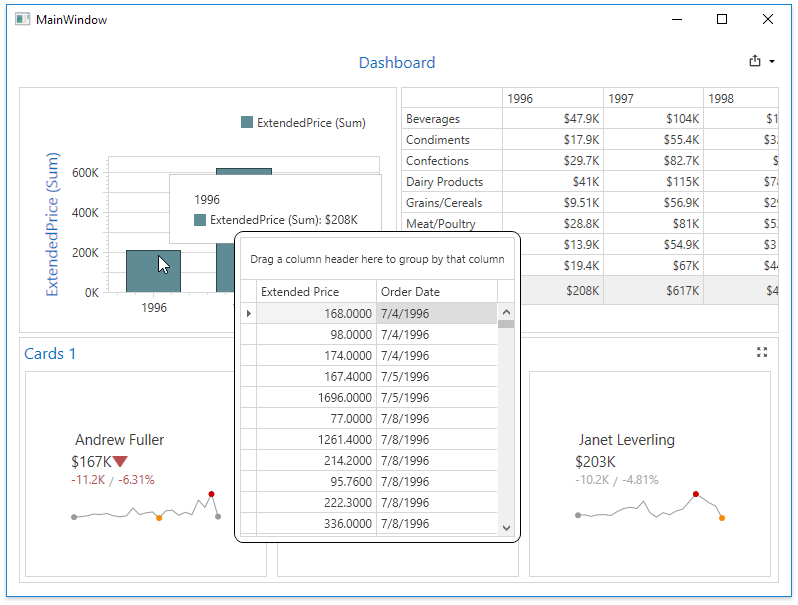

<!-- default badges list -->

<!-- default badges end -->
<!-- default file list -->
*Files to look at*:

* [MainWindow.xaml.cs](./CS/Dashboard_UnderlyingDataWPF/MainWindow.xaml.cs) (VB: [MainWindow.xaml.vb](./VB/Dashboard_UnderlyingDataWPF/MainWindow.xaml.vb))
* [MainWindow.xaml](./CS/Dashboard_UnderlyingDataWPF/MainWindow.xaml) (VB: [MainWindow.xaml](./VB/Dashboard_UnderlyingDataWPF/MainWindow.xaml))
<!-- default file list end -->

# Dashboard for WPF - How to obtain dashboard item's underlying data when the mouse hovers over it

This example handles the [DashboardControl.DashboardItemMouseEnter](https://docs.devexpress.com/Dashboard/DevExpress.DashboardWpf.DashboardControl.DashboardItemMouseEnter), [DashboardControl.DashboardItemMouseMove](https://docs.devexpress.com/Dashboard/DevExpress.DashboardWpf.DashboardControl.DashboardItemMouseMove) and [DashboardControl.DashboardItemMouseLeave](https://docs.devexpress.com/Dashboard/DevExpress.DashboardWpf.DashboardControl.DashboardItemMouseLeave) events to display a popup that contains a [Data Grid](https://docs.devexpress.com/WPF/6084/controls-and-libraries/data-grid) control to display item data when the mouse hovers over it. The data are obtained using the [e.GetUnderlyingData](https://docs.devexpress.com/Dashboard/DevExpress.DashboardWpf.DashboardItemMouseActionWpfEventArgs.GetUnderlyingData) method.

## Documentation

- [Underlying and Displayed Data](https://docs.devexpress.com/Dashboard/400159/wpf-viewer/obtain-underlying-and-displayed-data)

## More Examples

- [How to handle a mouse click to obtain dashboard item data](https://github.com/DevExpress-Examples/wpf-dashboard-how-to-obtain-clicked-item-data)
<!-- feedback -->
## Does this example address your development requirements/objectives?

 

(you will be redirected to DevExpress.com to submit your response)
<!-- feedback end -->
